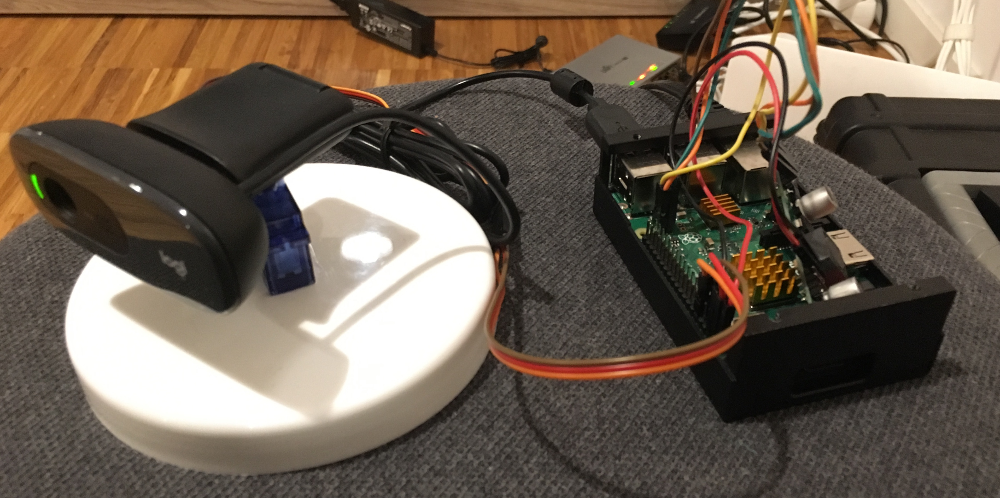

# Open Networking Summit EU 2019
This repository contains the demo code for my Open Networking Summit EU 2019 talk about Kubernetes clusters across clouds using Kilo.
In this demo we will imagine we are a company like Nest that is running object detection processes on video captured by IoT devices.
We will run a web-app in the cloud connected to a GPU-powered image detection and labeling service in a different public cloud provider.
The web-app will stream video from the IoT device over a WireGuard connection to keep the data safe.

Specifically we will:
* create a multi-cloud cluster that spans between DigitalOcean and AWS
* create some GPU workers in AWS
* run the workload that captures video in a device on the edge, e.g. your host capturing video from the webcam, or an edge device running Kubernetes
* peer the workload with the cluster in the cloud
* run a computer vision process on the video captured by the edge workload
* accelerate the computer vision using GPUs in AWS.

## Prerequisites
You will need:
* DigitalOcean and AWS accounts
* Terraform installed
* the Kilo commandline utility `kgctl` installed
* WireGuard installed
* *optional*: an edge device running Kubernetes with WireGuard installed, e.g. k3s on a Raspberry Pi

## Getting Started

Modify the provided `terraform.tfvars` file to suit your project:

```sh
$EDITOR terraform.tfvars
```

## Running

### Exercise 0: create the infrastructure

1. Create the infrastructure using Terraform:
```shell
terraform init
terraform apply --auto-approve
```

2. Annotate the GPU nodes so Kilo knows they are in their own data center:
```shell
for node in $(kubectl get nodes | grep -i ip- | awk '{print $1}'); do kubectl annotate node $node kilo.squat.ai/location="aws"; done
```

3. Install the Kilo manifests:
We'll use a DaemonSet to install the WireGuard and NVIDIA kernel modules on the nodes and install Kilo.
```shell
kubectl apply -f manifests/0/
```

4. Create the local WireGuard link:
```shell
IFACE=wg0
sudo ip link add $IFACE type wireguard
sudo ip a add 10.5.0.4 dev $IFACE
sudo ip link set up dev $IFACE
```

5. Generate a key-pair for the WireGuard link:
```shell
wg genkey | tee privatekey | wg pubkey > publickey
```

6. Create a Kilo Peer on the cluster for the local WireGuard link:
```shell
PEER=squat
cat <<EOF | kubectl apply -f -
apiVersion: kilo.squat.ai/v1alpha1
kind: Peer
metadata:
  name: $PEER
spec:
  allowedIPs:
  - 10.5.0.4/32
  publicKey: $(cat publickey)
  persistentKeepalive: 10
EOF
```

7. Configure the cluster as a peer of the local WireGuard link:
```shell
kgctl showconf peer $PEER > peer.ini
sudo wg setconf $IFACE peer.ini
sudo wg set $IFACE private-key privatekey
sudo ip route add 10.4.0.0/16 dev wg0
```

8. Verify we can connect to the cluster's WireGuard endpoint:
```shell
ping 10.4.0.1
```

9. Add routes to the cluster's allowed IPs:
```shell
for ip in $(kgctl showconf peer $PEER | grep AllowedIPs | cut -f 3- -d ' ' | tr -d ','); do
	sudo ip route add $ip dev $IFACE
done
```

10. Inspect the cluster's topology:
We'll use the Kilo command line tool to generate a GraphViz graph showing the cluster's topology.
```shell
kgctl graph | circo -Tsvg > cluster.svg && $BROWSER cluster.svg
```

### Exercise 1: connect the IoT camera to the cluster

1. Run the video capture service on the "edge":
Let's run a service producing an MJPEG stream on the local host to simulate an IoT webcam.
```shell
docker run --rm --privileged -p 8080:8080 squat/kubeconeu2019:amd64-latest /mjpeg
```

2. Create a Service to expose the webcam to the cluster:
The object detection application needs to be able to stream video from the webcam.
In order to accomplish this we'll create a Service and Endpoints resource that points to the webcam container running locally.
```shell
cat <<EOF | kubectl apply -f -
apiVersion: v1
kind: Service
metadata:
  name: mjpeg
spec:
  ports:
    - port: 8080
---
apiVersion: v1
kind: Endpoints
metadata:
    name: mjpeg
subsets:
  - addresses:
      - ip: 10.5.0.4
    ports:
      - port: 8080
EOF
```

3. Run the object detection application:
```shell
kubectl apply -f manifests/1/
```

4. Check out the webapp in a browser!
Note that we can use the container's Pod IP in the browser to access the workload; we are not port-forwarding!
```shell
$BROWSER $(kubectl get pods -o=jsonpath='{range .items[*]}{.metadata.name}{"\t"}{.status.podIP}{"\n"}{end}' | grep kceu | cut -f 2):8080
```

5. Clean up the manually created Service:
```shell
kubectl delete service mjpeg
kubectl delete endpoints mjpeg
```

### Exercise 2: connect two Kubernetes clusters
Kilo can also be used as a general purpose multi-cluster tool.
To demonstrate this, let's connect another cluster to the one we have running in the cloud.
In this exercise, let's imagine that our company chooses to run all of our edge workloads as containers on single node Kubernetes clusters.
Specifically, we'll say that our company sells webcams connected to small servers running Kubernetes, e.g. Raspberry Pis running k3s.
Let's call `KUBECONFIG1` the configuration for the cluster in the cloud and `KUBECONFIG2` the configuration for the edge cluster.

1. Install Kilo on the Raspberry Pi running k3s:
```shell
kubectl --kubeconfig $KUBECONFIG2 apply -f manifests/2/kilo-k3s-flannel.yaml
```

2. Run the webcam container on the edge cluster:
```shell
kubectl --kubeconfig $KUBECONFIG2 apply -f manifests/2/mjpeg.yaml
```

3. *optional*: Mount the camera on a servo and run the servo webapp:
```shell
kubectl --kubeconfig $KUBECONFIG2 apply -f manifests/2/servor.yaml
```



4. Register the two clusters with each other:
```shell
# The default Typhoon service CIDR.
SERVICECIDR1=10.3.0.1/16
# The WireGuard port used by the cluster.
WGPORT1=51820
# The default k3s service CIDR.
SERVICECIDR2=10.43.0.0/16
# The WireGuard port used by the edge node.
WGPORT2=51821
# Register the nodes in cluster1 as peers of cluster2.
for n in $(kubectl --kubeconfig $KUBECONFIG1 get no -o name | cut -d'/' -f2); do
    # Specify the service CIDR as an extra IP range that should be routable.
    kgctl --kubeconfig $KUBECONFIG1 --port $WGPORT1 showconf node $n --as-peer -o yaml --allowed-ips $SERVICECIDR1 | kubectl --kubeconfig $KUBECONFIG2 apply -f -
done
# Register the nodes in cluster2 as peers of cluster1.
for n in $(kubectl --kubeconfig $KUBECONFIG2 get no -o name | cut -d'/' -f2); do
    # Specify the service CIDR as an extra IP range that should be routable.
    kgctl --kubeconfig $KUBECONFIG2 --port $WGPORT2 showconf node $n --as-peer -o yaml --allowed-ips $SERVICECIDR2 | kubectl --kubeconfig $KUBECONFIG1 apply -f -
done
```

5. Inspect the cluster's topology:
We'll use the Kilo command line tool to generate a GraphViz graph showing the cluster's topology.
```shell
kgctl --kubeconfig $KUBECONFIG1 graph | circo -Tsvg > cluster.svg && $BROWSER cluster.svg
```

6. Mirror the Raspberry Pi's Service in the cloud cluster:
The object detection application needs to be able to stream video from the webcam.
In order to accomplish this we'll create a Service and Endpoints resource that points to the webcam container running in the k3s cluster.
```shell
cat <<EOF | kubectl apply -f -
apiVersion: v1
kind: Service
metadata:
  name: mjpeg
spec:
  ports:
    - port: 8080
---
apiVersion: v1
kind: Endpoints
metadata:
    name: mjpeg
subsets:
  - addresses:
      - ip: $(kubectl --kubeconfig $KUBECONFIG2 get service mjpeg -o jsonpath='{.spec.clusterIP}') # The cluster IP of the mjep container on the Raspberry Pi.
    ports:
      - port: 8080
EOF
```

7. Check out the webapp in a browser!
```shell
$BROWSER $(kubectl --kubeconfig $KUBECONFIG1 get pods -o=jsonpath='{range .items[*]}{.metadata.name}{"\t"}{.status.podIP}{"\n"}{end}' | grep kceu | cut -f 2):8080
```

8. Clean up the manually created Service:
```shell
kubectl --kubeconfig $KUBECONFIG1 delete service mjpeg
kubectl --kubeconfig $KUBECONFIG1 delete endpoints mjpeg
```

### Exercise 3: bonus!
Manually creating a Service in our cluster to mirror every Service that runs on the edge clusters will become hard to manage.
To simplify this, we can use a controller fully automate the reflection of Services from one cluster to another, [Service-Reflector](https://github.com/squat/service-reflector). 

1. Create an emitter in the edge cluster:
This container will publish selected Services for other controllers to mirror.
```shell
kubectl --kubeconfig $KUBECONFIG2 apply -f manifests/3/emitter.yaml
```

2. Register the emitter as a source of the cluster in the cloud:
```
# Register the emitter in cluster1 as a source of the reflector in cluster2.
cat <<EOF | kubectl --kubeconfig $KUBECONFIG1 apply -f -
apiVersion: v1
kind: ConfigMap
metadata:
  name: service-reflector
data:
  source-api: http://$(kubectl --kubeconfig $KUBECONFIG2 get service service-reflector -o jsonpath='{.spec.clusterIP}'):8080
EOF
```

3. Create a reflector in the cloud cluster:
This deployment will mirror the Services published by the configured sources so that they can be natively consumed in the local cluster.
```shell
kubectl --kubeconfig $KUBECONFIG1 apply -f manifests/3/reflector.yaml
```

4. Verify that we can still access our application:
```shell
$BROWSER $(kubectl --kubeconfig $KUBECONFIG1 get pods -o=jsonpath='{range .items[*]}{.metadata.name}{"\t"}{.status.podIP}{"\n"}{end}' | grep kceu | cut -f 2):8080
```

### Clean Up
1. Finally, use Terraform to clean everything up:
```shell
terraform destroy --auto-approve
```
